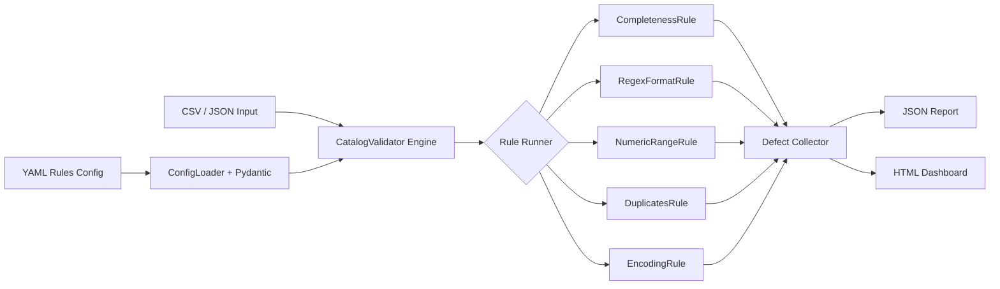

# 📦 catalog-data-validator

[](https://github.com/veronikay1309/Gen-ai/actions/workflows/ci.yml)
[](https://www.python.org/downloads/)
[](LICENSE)
[]()
[]()

> Automated data quality engine for product catalogs — validates, scores, and reports metadata defects at scale.

---

## 🎯 Problem Statement

E-commerce catalog teams manage millions of product records across multiple data sources. Inconsistent metadata — missing ASINs, malformed prices, duplicate listings, encoding errors — directly impacts search ranking, customer experience, and operational efficiency.

**`catalog-data-validator`** is a configurable, rule-based validation engine that ingests product catalogs (CSV/JSON), applies a suite of quality checks, and generates a detailed defect report (HTML dashboard + JSON) with severity scoring — enabling teams to detect and fix data quality issues before they reach production.

---

## 🏗️ Architecture



**Design Pattern:** Strategy Pattern — each validation rule is a self-contained class implementing a `validate(df) → defects` interface. New rules can be added without modifying the core engine.

---

## ✨ Features

- **5 built-in validation rules** — completeness, regex format, numeric range, exact/fuzzy deduplication, encoding anomalies
- **Configurable via YAML** — define rules, severity levels, and thresholds without touching code
- **Severity scoring** — CRITICAL / WARNING / INFO per defect
- **HTML dashboard** — interactive, dark-mode report with filterable defect table and breakdown charts
- **JSON report** — structured output for downstream processing or CI integration
- **CLI interface** — single command to validate any catalog file
- **Pluggable architecture** — add custom rules by extending the `ValidationRule` base class
- **Fuzzy duplicate detection** — sliding-window sorted comparison ($O(N \log N)$) for near-duplicate title detection

---

## 🚀 Quick Start

```bash
# 1. Clone the repo
git clone https://github.com/veronikay1309/Gen-ai.git
cd Gen-ai/catalog-data-validator

# 2. Install dependencies (creates a virtual environment automatically)
make install

# 3. Generate sample catalog data (10,000 realistic product records)
make generate-data

# 4. Run validation
make run
```

### Sample Output

```
🔍 Loading validator rules from configs/ecommerce_rules.yaml...
📦 Loading catalog dataset from sample_data/products_10k.csv...
⚡ Running 5 validation rules against 10,000 records...
💾 Saving reports to reports/...

=================== VALIDATION SUMMARY ===================
✅ Total Records Validated:  10,000
⚠️  Total Defects Detected:    896
🚨 Defective Records Count:   784  (7.84%)

Severity Breakdown:
  - CRITICAL: 648
  - WARNING:  248
  - INFO:       0
==========================================================
HTML dashboard generated: reports/report.html
```

---

## ⚙️ Configuration

Rules are defined in YAML — no code changes needed to add or modify validation logic.

```yaml
# configs/ecommerce_rules.yaml
rules:
  - type: completeness
    name: check_required_fields
    severity: CRITICAL
    params:
      columns: [id, title, price, asin, category, stock]

  - type: regex_format
    name: check_asin_format
    severity: CRITICAL
    params:
      patterns:
        asin: "^B[A-Z0-9]{9}$"

  - type: numeric_range
    name: check_pricing_and_stock
    severity: WARNING
    params:
      ranges:
        price: { min: 0.01, max: 50000.0 }
        stock: { min: 0 }

  - type: duplicates
    name: check_identity_duplicates
    severity: CRITICAL
    params:
      key_columns: [id, asin]
      fuzzy_column: title
      fuzzy_threshold: 0.90

  - type: encoding
    name: check_text_encoding
    severity: WARNING
    params:
      columns: [title, description]
      detect_mojibake: true
```

### Available Rule Types

| Type | Description |
|------|-------------|
| `completeness` | Detects null, empty, or whitespace-only values |
| `regex_format` | Validates string values against regex patterns (e.g., ASIN format) |
| `numeric_range` | Ensures numeric fields fall within min/max bounds |
| `duplicates` | Finds exact key duplicates + fuzzy near-duplicate titles |
| `encoding` | Detects Unicode replacement characters and Mojibake artifacts |

---

## 📊 Reports

After running validation, two reports are saved to `reports/`:

### HTML Dashboard (`reports/report.html`)
- Quality score badge
- Defect summary cards (total, defective, defect rate)
- Defect distribution bar charts by rule and column
- Filterable, searchable defect register table
- Severity filter buttons (CRITICAL / WARNING / INFO)

### JSON Report (`reports/report.json`)
```json
{
  "summary": {
    "total_records": 10000,
    "total_defects": 896,
    "defective_records": 784,
    "defect_rate": 0.0784,
    "severity_breakdown": { "CRITICAL": 648, "WARNING": 248, "INFO": 0 },
    "rule_breakdown": { "check_required_fields": 312, ... },
    "column_breakdown": { "asin": 215, "price": 248, ... }
  },
  "defects": [
    {
      "row_index": "PROD-100042",
      "column": "asin",
      "rule": "check_asin_format",
      "value": "A1B2C3D4",
      "severity": "CRITICAL",
      "message": "Value 'A1B2C3D4' does not match the required format pattern: ^B[A-Z0-9]{9}$"
    }
  ]
}
```

---

## 🧪 Running Tests

```bash
make test
```

```
============================= test session starts ==============================
collected 11 items

tests/test_rules.py::test_completeness_rule          PASSED
tests/test_rules.py::test_completeness_missing_column PASSED
tests/test_rules.py::test_regex_format_rule           PASSED
tests/test_rules.py::test_numeric_range_rule          PASSED
tests/test_rules.py::test_duplicates_rule_exact       PASSED
tests/test_rules.py::test_duplicates_rule_fuzzy       PASSED
tests/test_rules.py::test_encoding_rule               PASSED
tests/test_validator.py::test_config_loader           PASSED
tests/test_validator.py::test_config_loader_invalid_type PASSED
tests/test_validator.py::test_catalog_validator       PASSED
tests/test_validator.py::test_report_generation       PASSED

============================== 11 passed in 0.53s ==============================
Coverage: 69%
```

---

## 📁 Project Structure

```
catalog-data-validator/
├── README.md
├── requirements.txt
├── Makefile                        # Developer workflow automation
├── .github/
│   └── workflows/ci.yml            # GitHub Actions: lint + test on push
├── src/
│   ├── validator.py                # Core engine + CLI entrypoint
│   ├── config_loader.py            # YAML → Pydantic → Rule objects
│   ├── rules/
│   │   ├── __init__.py             # Abstract ValidationRule base class
│   │   ├── completeness.py         # Missing field detection
│   │   ├── format.py               # Regex + numeric range validation
│   │   ├── duplicates.py           # Exact + fuzzy deduplication
│   │   └── encoding.py             # Charset anomaly detection
│   ├── reporters/
│   │   ├── html_report.py          # Jinja2-based interactive HTML dashboard
│   │   └── json_report.py          # Structured JSON output
│   └── generate_mock_data.py       # Realistic 10K product catalog generator
├── configs/
│   ├── default_rules.yaml          # Standard validation ruleset
│   └── ecommerce_rules.yaml        # Strict e-commerce ruleset
├── tests/
│   ├── test_rules.py               # Unit tests for all rule strategies
│   └── test_validator.py           # Integration tests for engine + reporters
└── sample_data/
    └── products_10k.csv            # 10,000 mock products with injected defects
```

---

## 🛣️ Roadmap

- [ ] Add `StringLengthRule` (e.g., title length > 200 chars)
- [ ] REST API wrapper (FastAPI) for on-demand validation
- [ ] Time-series defect trend tracking (compare runs over time)
- [ ] Parallel rule execution for large datasets
- [ ] Support for JSON Lines (`.jsonl`) input format

---

## 🤝 Adding a Custom Rule

```python
# src/rules/my_rule.py
from src.rules import ValidationRule

class MyCustomRule(ValidationRule):
    def validate(self, df):
        defects = []
        # your logic here
        return defects
```

Then register it in `src/config_loader.py`:
```python
RULE_CLASS_MAP = {
    ...
    "my_custom": MyCustomRule,
}
```

And use it in YAML:
```yaml
- type: my_custom
  name: my_rule
  severity: WARNING
  params: {}
```

---

## 📄 License

MIT — see [LICENSE](LICENSE) for details.
