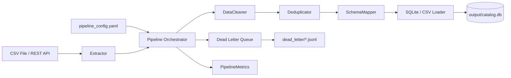

# 🔄 etl-pipeline-framework

[](https://github.com/veronikay1309/application-engineer-portfolio/actions/workflows/ci.yml)
[](https://www.python.org/downloads/)
[](LICENSE)

> Lightweight, pluggable ETL pipeline framework for multi-source data ingestion — with retry logic, dead-letter queuing, structured logging, and processing metrics.

---

## 🎯 Problem Statement

Data engineering teams need reliable, observable pipelines that can ingest product and catalog data from heterogeneous sources (flat files, REST APIs, databases), apply transformation logic, and load it into a target store — all without data loss, duplicates, or silent failures.

**`etl-pipeline-framework`** provides a production-ready pattern for building such pipelines: fully configurable via YAML, with built-in observability (metrics, dead-letter queue, structured logging) and resilience (exponential backoff retry).

---

## 🏗️ Architecture



**Design Principles:**
- **Plugin-based** — swap extractors, transformers, loaders via YAML config
- **Idempotent loads** — upsert logic prevents duplicates on re-runs
- **Fail-safe** — individual record failures are captured in the dead-letter queue without crashing the pipeline

---

## ✨ Features

- **2 extractors** — CSV files, paginated REST APIs with rate limiting
- **3 transformers** — whitespace/null cleaning, exact deduplication, column schema mapping
- **2 loaders** — SQLite (with upsert), CSV output
- **Exponential backoff retry** — configurable per pipeline
- **Dead-letter queue** — failed records saved as timestamped JSONL files with error context
- **Processing metrics** — records/sec, success rate, duration, failure count
- **Fully YAML-driven** — no code changes needed for new pipeline configurations

---

## 🚀 Quick Start

```bash
# 1. Clone & navigate
git clone https://github.com/veronikay1309/application-engineer-portfolio.git
cd application-engineer-portfolio/etl-pipeline-framework

# 2. Install dependencies
make install

# 3. Generate sample raw data
make generate-data

# 4. Run the pipeline
make run
```

### Sample Output

```
🚀 Starting pipeline: 'product-catalog-etl'
✅ Extracted 5,000 records.
✅ 4,623 records after transformations.
✅ Loaded 4,623 records to destination.

=================== PIPELINE METRICS ===================
  Pipeline:           product-catalog-etl
  Records Extracted:  5,000
  After Transform:    4,623
  Records Loaded:     4,623
  Records Failed:     0
  Success Rate:       92.46%
  Duration:           1.842s
  Throughput:         2,510.3 records/sec
=========================================================
```

---

## ⚙️ Configuration

```yaml
# configs/pipeline_config.yaml
pipeline:
  name: "product-catalog-etl"

  source:
    type: csv                          # or 'api'
    path: sample_data/raw_products.csv
    encoding: utf-8

  transformers:
    - type: cleaner
      params:
        strip_whitespace: true
        lowercase_columns: [category, brand]
        drop_nulls_in: [id, title, price]

    - type: deduplicator
      params:
        key_columns: [id]

    - type: schema_mapper
      params:
        rename:
          prod_id: id
          prod_title: title
        keep_columns: [id, title, price, category, brand, stock, asin]

  destination:
    type: sqlite
    path: output/catalog.db
    table: products
    if_exists: replace                 # replace | append | upsert

retry:
  max_attempts: 3
  backoff_factor: 2                    # delays: 1s, 2s, 4s

dead_letter:
  enabled: true
  path: dead_letter/
```

---

## 🧪 Running Tests

```bash
make test
```

```
collected 14 items

tests/test_extractors.py::test_csv_extractor_basic              PASSED
tests/test_extractors.py::test_csv_extractor_column_selection   PASSED
tests/test_extractors.py::test_csv_extractor_missing_column     PASSED
tests/test_extractors.py::test_csv_extractor_file_not_found     PASSED
tests/test_transformers.py::test_cleaner_strips_whitespace       PASSED
tests/test_transformers.py::test_cleaner_lowercase_columns       PASSED
tests/test_transformers.py::test_cleaner_drops_nulls             PASSED
tests/test_transformers.py::test_deduplicator_removes_exact_duplicates PASSED
tests/test_transformers.py::test_deduplicator_missing_key_column PASSED
tests/test_transformers.py::test_schema_mapper_renames_columns   PASSED
tests/test_transformers.py::test_schema_mapper_keeps_columns     PASSED
tests/test_transformers.py::test_schema_mapper_skips_missing_keeps PASSED
tests/test_pipeline.py::test_retry_succeeds_on_first_attempt     PASSED
tests/test_pipeline.py::test_retry_retries_on_failure            PASSED
...
```

---

## 📁 Project Structure

```
etl-pipeline-framework/
├── README.md
├── requirements.txt
├── Makefile
├── .github/workflows/ci.yml       # GitHub Actions CI
├── configs/
│   └── pipeline_config.yaml       # Pipeline definition
├── src/
│   ├── pipeline.py                # Orchestrator + CLI entrypoint
│   ├── retry.py                   # Exponential backoff decorator
│   ├── dead_letter.py             # Failed record queue
│   ├── metrics.py                 # Run statistics tracking
│   ├── extractors/
│   │   ├── csv_extractor.py       # CSV file reader
│   │   └── api_extractor.py       # Paginated REST API reader
│   ├── transformers/
│   │   ├── cleaner.py             # Whitespace, null, casing normaliser
│   │   ├── deduplicator.py        # Exact duplicate remover
│   │   └── schema_mapper.py       # Column rename and selection
│   ├── loaders/
│   │   ├── sqlite_loader.py       # SQLite upsert loader
│   │   └── csv_loader.py          # CSV output writer
│   └── generate_sample_data.py    # Mock data generator
├── tests/
│   ├── test_extractors.py
│   ├── test_transformers.py
│   └── test_pipeline.py           # Integration + retry + DLQ tests
└── sample_data/
    └── raw_products.csv            # 5K messy product records
```

---

## 🛣️ Roadmap

- [ ] PostgreSQL loader with connection pooling
- [ ] API extractor with OAuth2 token refresh
- [ ] Scheduler (cron-based) for periodic pipeline runs
- [ ] Prometheus metrics endpoint for real-time monitoring
- [ ] Parallel batch processing for large datasets

---

## 📄 License

MIT
