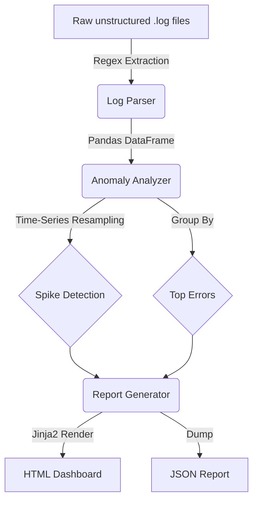

# 🚨 incident-log-analyzer

[](https://github.com/veronikay1309/application-engineer-portfolio/actions/workflows/ci.yml)
[](https://www.python.org/downloads/)

> An automated log parser and anomaly detection tool that extracts structured data from unstructured logs and identifies critical error spikes for on-call engineers.

---

## 🎯 Problem Statement

Application Engineers and SREs spend hours tailing logs and grepping for errors during incidents. When a system goes down, identifying *when* the spike started and *which* error is the root cause is critical for reducing Mean Time To Resolution (MTTR).

**`incident-log-analyzer`** solves this by:
1. Parsing unstructured text logs into structured data (DataFrame) using Regex.
2. Statistically analyzing error rates to detect anomalies (spikes) across time windows.
3. Grouping recurring errors to filter out noise.
4. Generating a clear HTML/JSON report for the post-mortem.

---

## 🏗️ Architecture



---

## ✨ Features

- **Regex Log Parsing**: Extracts Timestamp, Severity, Service Name, Message, and Error Codes from massive text files, ignoring unparseable stack traces.
- **Statistical Anomaly Detection**: Uses Pandas time-series resampling to calculate a rolling baseline error rate. If a window exceeds `3x` the baseline, it's flagged as an anomaly.
- **Error Deduplication**: Groups identical errors by service and message to cut through log noise and present actionable root causes.
- **Post-Mortem Reports**: Auto-generates an HTML dashboard and JSON file summarizing the incident for documentation.

---

## 🚀 Quick Start

```bash
# 1. Install dependencies
make install

# 2. Generate sample logs (10,000 lines with an injected anomaly)
make generate-data

# 3. Run the analyzer
make run
```

### Sample Output

```text
Parsing log file: data/system.log
Successfully parsed 10000 log entries.
Detected 1 anomalous spikes.
JSON report saved to: output/incident_report.json
HTML report saved to: output/incident_report.html
✅ Analysis Complete.
```

**Check the `output/` directory for `incident_report.html`!**

---

## 🧪 Testing

The tool includes a comprehensive test suite covering regex edge cases and anomaly detection logic:

```bash
make test
```

## 📄 License
MIT
