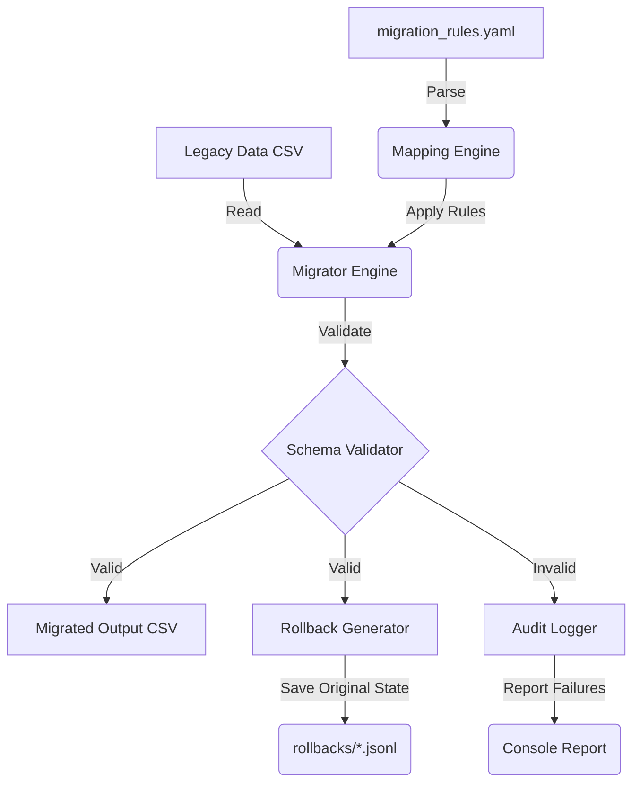

# 🔄 metadata-migration-tool

[](https://github.com/veronikay1309/application-engineer-portfolio/actions/workflows/ci.yml)
[](https://www.python.org/downloads/)

> A declarative schema migration engine for transforming legacy product metadata into strict new target formats, built with safety (dry-runs, rollbacks) in mind.

---

## 🎯 Problem Statement

When migrating catalog data from a legacy system to a new platform, data loss and schema corruption are major risks. Amazon Application Engineers are frequently tasked with writing scripts to "migrate templates" and ensure data integrity during cutovers.

**`metadata-migration-tool`** solves this by separating migration logic (declarative YAML rules) from execution. It strictly validates the output using Pydantic, supports dry-runs to preview errors, and generates rollback files so any migration can be safely reverted.

---

## 🏗️ Architecture



---

## ✨ Features

- **Declarative YAML Mapping**: Configure direct maps, computed concatenations, type casting, and value dictionaries without code changes.
- **Pydantic Validation**: Target schemas are strictly enforced. Invalid records are rejected and logged, never corrupting the output.
- **Dry-Run Mode**: Safely test migration rules on production data without writing output files.
- **Automatic Rollbacks**: For every successful record written, its original legacy state is saved to a JSONL file, allowing seamless rollback.
- **Detailed Audit Reports**: See exactly how many records processed, passed, or failed, along with field-level validation errors.

---

## 🚀 Quick Start

```bash
# 1. Install dependencies
make install

# 2. Generate sample legacy data
make generate-data

# 3. Run a Dry-Run (Safe preview)
make run-dry

# 4. Execute the Migration
make run
```

### Sample Audit Output

```
🚀 Starting migration: 'Legacy Product to V2 Schema Migration'
Mode: EXECUTE
Loaded 1000 legacy records from sample_data/legacy_products.csv

=================== MIGRATION AUDIT REPORT ===================
  Total Records Processed: 1000
  Successfully Migrated:   947
  Validation Failures:     53
==============================================================

Top 5 Validation Failures:
  - Record [LEGACY-10034]: [title]: String should have at least 1 characters
  - Record [LEGACY-10112]: [price]: Input should be greater than or equal to 0.0
  - Record [LEGACY-10250]: [price]: Input should be a valid number, unable to parse string as a number
...
💾 Rollback file generated: rollbacks/rollback_legacy_product_to_v2_schema_migration_20260615.jsonl
✅ Wrote 947 migrated records to output/migrated_products.csv
```

---

## ⚙️ Configuration Example

`configs/migration_rules.yaml`:

```yaml
migration:
  name: "Legacy to V2 Schema"
  primary_key: "item_sku"

  rules:
    direct:
      item_sku: sku
      product_name: title

    defaults:
      currency: "USD"

    computed:
      - target: price
        type: cast
        source: base_price
        to_type: float
        
      - target: category
        type: map_values
        source: dept
        mapping:
          "Elec": "Electronics"
        default: "Other"
```

---

## 🧪 Testing

The tool includes a comprehensive test suite (unit + integration):

```bash
make test
```

## 📄 License
MIT
