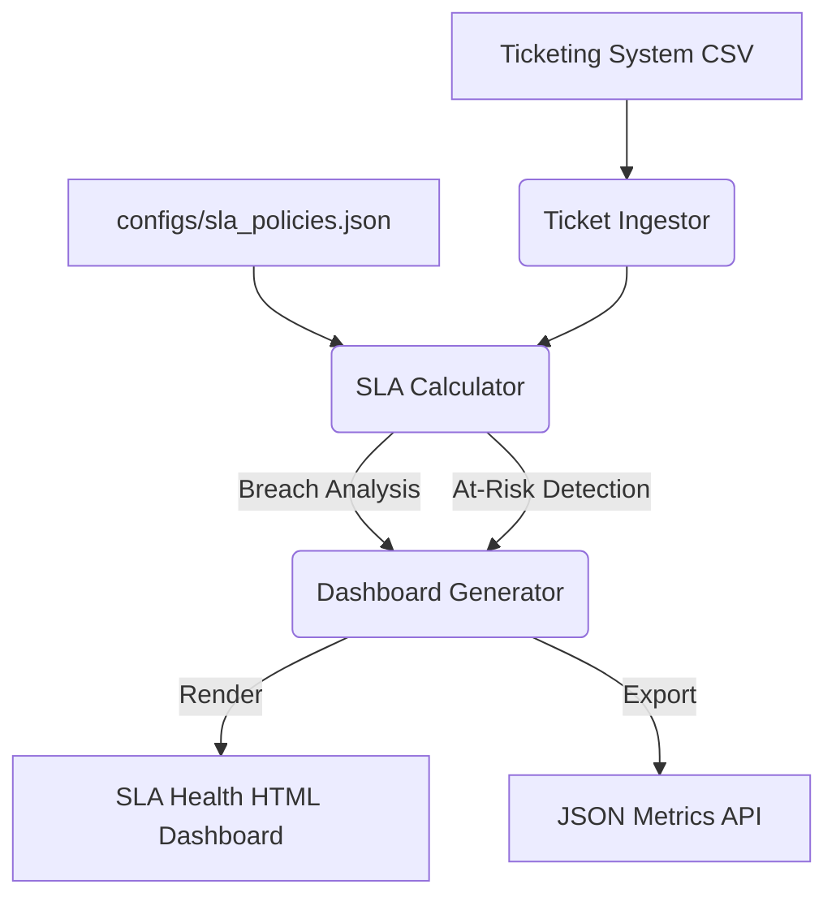

# ⏱️ sla-ticket-tracker

[](https://github.com/veronikay1309/application-engineer-portfolio/actions/workflows/ci.yml)
[](https://www.python.org/downloads/)

> An automated operational metrics engine that calculates Service Level Agreement (SLA) breaches and generates proactive alerts for at-risk support tickets.

---

## 🎯 Problem Statement

Operational Excellence requires strict adherence to SLAs. However, engineering teams often rely on reactive reporting (finding out about breached tickets during a weekly business review). Application Engineers need proactive monitoring to intervene *before* an SLA is breached.

**`sla-ticket-tracker`** solves this by:
1. Ingesting open and closed ticket data.
2. Calculating elapsed time against dynamic, severity-based SLA policies.
3. Flagging tickets that are approaching their SLA limits (`At-Risk`).
4. Generating automated HTML and JSON health metrics dashboards for leadership.

---

## 🏗️ Architecture



---

## ✨ Features

- **Dynamic Policy Configuration**: Define SLA limits per severity via JSON (e.g., SEV1 = 1 hour, SEV2 = 4 hours) without altering code.
- **Proactive 'At-Risk' Detection**: Automatically identifies open tickets that have consumed >80% of their allowed SLA time, allowing teams to prioritize them.
- **Accurate Time Calculation**: Uses Pandas datetime vectorization to compute exact resolution times for both open and closed tickets.
- **Operational Metrics Dashboard**: Generates a Jinja2-powered HTML report highlighting total breaches, breach percentage, and average resolution times.

---

## 🚀 Quick Start

```bash
# 1. Install dependencies
make install

# 2. Generate simulated ticket queue (5,000 tickets)
make generate-data

# 3. Run the SLA tracking engine
make run
```

### Sample Output

```text
Loading tickets from data/tickets.csv...
Successfully loaded 5000 tickets.
Saved JSON metrics to output/sla_metrics.json
Saved HTML dashboard to output/sla_dashboard.html
✅ SLA processing complete.
```

**Open `output/sla_dashboard.html` in your browser to view the operational metrics!**

---

## ⚙️ Configuration

You can tune the SLA limits and the `At-Risk` threshold in `configs/sla_policies.json`:

```json
{
    "policies": {
        "SEV1": { "limit_hours": 1 },
        "SEV2": { "limit_hours": 4 },
        "SEV3": { "limit_hours": 24 }
    },
    "at_risk_threshold": 0.8
}
```

---

## 🧪 Testing

Includes unit tests for time math and integration tests for the full pipeline:

```bash
make test
```

## 📄 License
MIT
